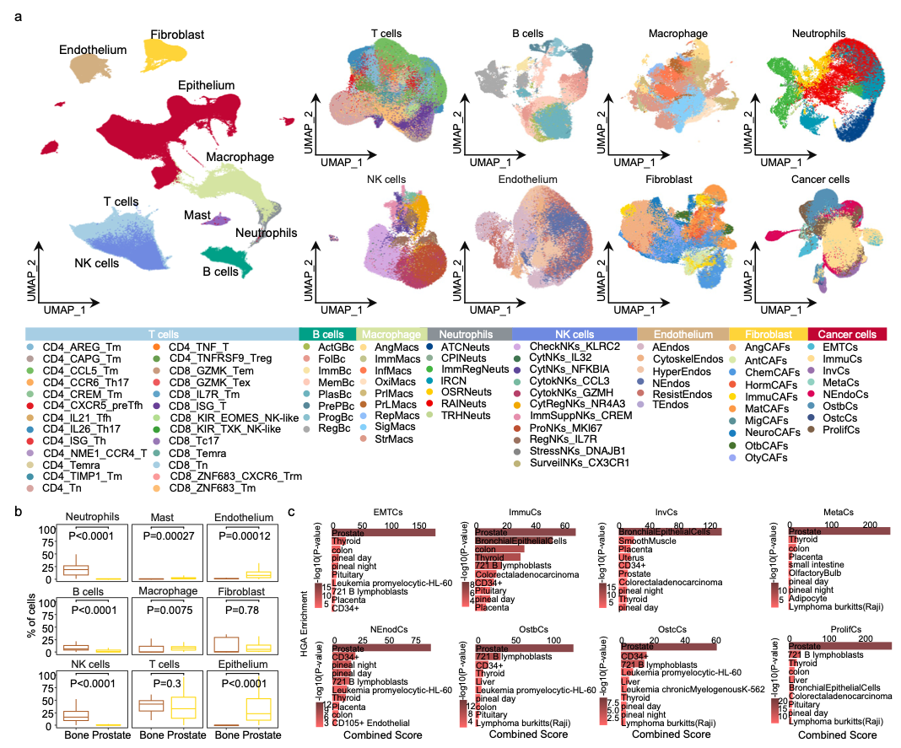

# **scRNA-seq indicates chrY genes UTY and USP9Y as key drivers of immune evasion and bone metastasis in prostate cancer**

The Y chromosome (ChrY) is significantly linked to tumor as potential determinants of cancer hallmarks and clinical outcomes, although its molecular characteristics and biological significance remain unclear. This study investigates the effects of ChrY genes on prostate cancer (PCa) at the single-cell level. An in-depth analysis of 149 samples revealed that mutations and aberrant expressions of the UTY and USP9Y on the ChrY likely play crucial roles in PCa cells. Both genes are likely instrumental in developing a classical immunosuppressive TME by fostering abnormal metabolic activities in PCa. During bone metastasis, UTY and USP9Y facilitate the development of a bone metastatic microenvironment through enhanced lipid metabolism and lactate production. Furthermore, high expression of UTY and USP9Y is associated with active prostaglandin E2 synthesis pathways and increased expression of the taurine transporter SLC6A6 in PCa cells. This indicates that high expression of UTY and USP9Y might be involved in inhibiting the activation of tumor-infiltrating T cells and in promoting the exhaustion of these activated cells.

<b>The single-cell transcriptome landscape of 149 samples with PCa</b>

## Pre-requisites:

- Linux (Based on Ubuntu 20.04 LTS, Personal Computer) 
- CPU AMD Ryzen threadripper pro 3975wx 32-cores x 64
- NVIDIA GeForce RTX 3090 24GB 384bit 1695MHz 19500MHz 
- Memory 1.024 TiB (128GB * 8) DDR4 2666MHz
